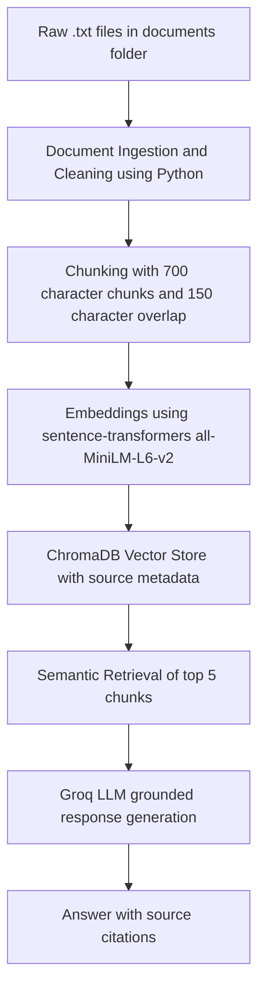

# The Unofficial UIUC CS Guide

## Project Overview

The Unofficial UIUC CS Guide is a retrieval-augmented generation system that answers questions about UIUC computer science courses and professors using unofficial student sources. The system uses Reddit discussions and Rate My Professors review summaries to answer questions about workload, difficulty, professor teaching style, support resources, useful courses, and student advice.

The goal is to make scattered student knowledge easier to search. Official course catalogs explain prerequisites and topics, but they usually do not explain what students actually experience in a class. This project uses RAG so answers are grounded in collected documents instead of generated from memory.

---

## Domain

My domain is unofficial student advice about UIUC computer science courses and professors. I chose this domain because students often want to know what a course is really like before registering. Information about workload, exams, machine problems, office hours, professor style, and useful classes is usually spread across Reddit threads, Rate My Professors reviews, and peer conversations.

This information is valuable because it helps students make better course planning decisions. For example, a student may want to know whether CS 374 is manageable with a heavy schedule, whether CS 128 has enough support resources, or which CS electives alumni found useful for jobs. These questions are hard to answer through official channels because official pages usually describe course content, not the real student experience.

---

## Data Sources

I used 10 manually collected plain text documents. The documents include Reddit threads and Rate My Professors review summaries.

| # | Source | File |
|---|--------|------|
| 1 | Reddit CS 225 what to expect thread | `documents/cs255_reviews.txt` |
| 2 | Reddit CS 128 workload and faculty support response | `documents/cs128_reviews.txt` |
| 3 | Reddit CS 357 Silva experience thread | `documents/cs375_reviews.txt` |
| 4 | Reddit CS 374 incoming sophomore thread | `documents/cs374_reviews.txt` |
| 5 | Rate My Professors Brad Solomon CS 225 reviews | `documents/professor_1_reviews.txt` |
| 6 | Rate My Professors Emily Fox CS 374 reviews | `documents/professor_2_reviews.txt` |
| 7 | Rate My Professors Michael Nowak CS 128 reviews | `documents/professor_3_reviews.txt` |
| 8 | Reddit favorite UIUC professors thread | `documents/reddit_best_cs_professors.txt` |
| 9 | Reddit useful CS classes alumni thread | `documents/reddit_course_advice.txt` |
| 10 | Reddit CS major workload thread | `documents/reddit_cs_workload.txt` |

---

## Pipeline Architecture



---

## Implementation

The project is split into several files:

- `ingest.py` loads the `.txt` files from the `documents/` folder, cleans the text, and creates chunks.
- `retrieval.py` embeds chunks using `all-MiniLM-L6-v2` and stores them in ChromaDB.
- `query.py` retrieves relevant chunks and sends them to the Groq LLM with a grounding prompt.
- `app.py` provides a Gradio web interface for asking questions.
- `eval.py` runs evaluation questions and prints expected answers, actual answers, sources, and retrieved chunks.

Each chunk stores metadata, including the source filename and chunk index. This metadata is used later for source attribution so the system can show which document the answer came from.

---

## Chunking Strategy

I used a chunk size of 700 characters with a 150-character overlap.

My documents are mostly Reddit discussions and Rate My Professors review summaries. These documents are shorter and more opinion-based than long textbooks or official manuals, so the chunks should not be too large. A 700-character chunk is large enough to keep a complete student opinion together, including context about the course, professor, workload, grading, or exams. At the same time, it is small enough that retrieval can still find specific information, such as comments about CS 374 difficulty, CS 225 workload, or CS 128 support resources.

The 150-character overlap helps preserve context when an important idea appears near the edge of a chunk. For example, a student might start by describing a course workload and then mention quizzes or exams at the end of the paragraph. Overlap makes it more likely that the full idea is still available in at least one retrieved chunk.

---

## Retrieval Approach

The system uses `all-MiniLM-L6-v2` from `sentence-transformers` to create embeddings. These embeddings are stored in ChromaDB. For each user query, the system retrieves the top 5 most relevant chunks.

I chose `all-MiniLM-L6-v2` because it runs locally, does not require an API key, and is fast enough for a small document collection. It also supports semantic search, which means it can find relevant chunks even when the query does not use the exact same words as the document.

The top-k value is set to 5 because retrieving too few chunks may miss the answer, while retrieving too many chunks may add unrelated context and confuse the LLM.

---

## How to Run

Install dependencies:

```bash
pip install -r requirements.txt
```

Create a `.env` file:

```bash
GROQ_API_KEY=your_key_here
```

Build and inspect chunks:

```bash
python ingest.py
```

Build and test retrieval:

```bash
python retrieval.py
```

Run evaluation:

```bash
python eval.py
```

Run the Gradio app:

```bash
python app.py
```

Then open:

```text
http://localhost:7860
```

---

## Evaluation Results

### Question 1

**Question:** What do students say about CS 225 workload and preparation?

**Expected answer:**  
The system should mention data structures, C++, machine problems, starting early, and weekly time commitment.

**Actual response:**  
The system said it did not have enough information from the provided documents. It explained that the retrieved context only discussed CS 128 and CS 357, not CS 225.

**Accuracy judgment:**  
Inaccurate

**Notes:**  
This was a retrieval failure. The answer itself was grounded because the model refused to invent information, but retrieval did not return the CS 225 document. Instead, it returned mostly `cs128_reviews.txt` and one `cs375_reviews.txt` chunk.

---

### Question 2

**Question:** What do students say about CS 128 workload and support resources?

**Expected answer:**  
The system should mention workload, grade data, office hours, Even More Practice, quiz reviews, and practice problems.

**Actual response:**  
The system explained that CS 128 workload is described as data-calibrated and within normal expectations for a 3-credit-hour engineering course. It mentioned that most students spend between 6 and 11 hours per week on CS 128, and it cited support resources such as quiz reviews, office hours, Even More Practice sessions, and additional practice problems. It also noted that attendance at support resources is limited.

**Accuracy judgment:**  
Accurate

**Notes:**  
The response matched the expected answer and used `cs128_reviews.txt` as the main source.

---

### Question 3

**Question:** What do students say about CS 374 difficulty and when to take it?

**Expected answer:**  
The system should mention CS 374 is theory-heavy, depends on CS 173/proofs/math maturity, can be a time sink, and is easier with a strong group.

**Actual response:**  
The system described CS 374 as challenging and theory-heavy. It said the course depends on mathematical maturity, proofs, recursion, and CS 173 background more than programming experience alone. It also said taking the course with friends or a strong group is helpful, especially because homework may be group-based.

**Accuracy judgment:**  
Accurate

**Notes:**  
The response matched the expected answer and cited `cs374_reviews.txt`.

---

### Question 4

**Question:** Which professors are described as helpful or good at teaching?

**Expected answer:**  
The system should mention professors supported by the documents, such as Brad Solomon, Emily Fox, Wade Fagen-Ulmschneider, Margaret Fleck, Jeff Erickson, Alvarez, or Zilles.

**Actual response:**  
The system mentioned Emily Fox, Professor Alvarez, Margaret Fleck, Wade Fagen-Ulmschneider, and Jeff Erickson. It described Emily Fox as helpful and supportive, Alvarez and Fleck as having coherent and interesting lectures, and Wade Fagen-Ulmschneider as an excellent professor with great lectures who cared about student success.

**Accuracy judgment:**  
Accurate

**Notes:**  
The response was supported by `professor_2_reviews.txt` and `reddit_best_cs_professors.txt`. Distance scores were high, but the returned chunks still contained relevant professor information.

---

### Question 5

**Question:** What useful CS classes do students or alumni recommend for jobs?

**Expected answer:**  
The system should mention CS 425, CS 411, CS 440, and ECE 391 if the correct source is retrieved.

**Actual response:**  
The system mentioned CS 425, CS 411, CS 440, and ECE 391. It also explained that ECE 391 was described as useful for systems programming and that CS 425 was considered useful but difficult.

**Accuracy judgment:**  
Accurate

**Notes:**  
The response matched the expected answer and used `reddit_course_advice.txt` as the main source.

---

### Out-of-Scope Test

**Question:** What do students say about UIUC dining halls?

**Expected answer:**  
The system should say it does not have enough information because the documents are about CS courses and professors, not dining halls.

**Actual response:**  
The system said it did not have enough information from the provided documents. It explained that the retrieved context did not contain information about UIUC dining halls.

**Accuracy judgment:**  
Accurate

**Notes:**  
This shows the grounding prompt worked. The system did not hallucinate a dining hall answer.

---

## Failure Case

**Failure question:**  
What do students say about CS 225 workload and preparation?

**What went wrong:**  
The system failed to answer the CS 225 question because retrieval returned mostly CS 128 chunks instead of the CS 225 document. The generated answer was actually grounded because it refused to answer without CS 225 context, but the retrieval step failed to provide the right evidence.

**Pipeline cause:**  
This is a retrieval-stage issue. The query included broad terms like "workload" and "preparation," which also appear in the CS 128 document. Since the embedding model searches semantically, it matched the general idea of course workload and support instead of prioritizing the exact course number CS 225.

**Evidence:**  
The retrieved chunks for this query came mostly from `cs128_reviews.txt`, with distances around 0.59 to 0.71, and one chunk from `cs375_reviews.txt`. The correct CS 225 source was not retrieved.

**How I would improve it:**  
I would add stronger metadata and filtering. For example, each chunk could include a `course` field such as `CS225`, `CS128`, or `CS374`. If a user query contains a course number, retrieval could filter to chunks from that course first. I would also rename typo files like `cs255_reviews.txt` to `cs225_reviews.txt` and make sure every chunk starts with the course number and title so the embedding has stronger course-specific context.

---

## Spec Reflection

One way my spec helped was by forcing me to decide my chunk size, overlap, embedding model, top-k, and evaluation questions before coding. This made implementation easier because I could directly build `ingest.py` and `retrieval.py` around the planned 700-character chunks, 150-character overlap, `all-MiniLM-L6-v2`, ChromaDB, and top-k retrieval.

One way my implementation diverged from the original plan was that chunking needed more debugging than expected. A simple fixed-character splitter created chunks that started in the middle of words, so I improved the chunking code to split more cleanly around paragraph and sentence boundaries while still keeping the planned chunk size and overlap idea. This made the chunks easier to read and better for retrieval.

---

## AI Usage

I used ChatGPT to help implement the ingestion and chunking pipeline. I gave it my `planning.md` chunking strategy, document folder name, and requirement to print five sample chunks. It produced an initial `ingest.py` script. I reviewed the output and noticed some chunks started in the middle of words, so I changed the implementation to use cleaner paragraph and sentence-style boundaries.

I used ChatGPT to help implement the embedding and retrieval pipeline. I gave it my retrieval approach using `all-MiniLM-L6-v2`, ChromaDB, top-k of 5, and source metadata requirements. It produced `retrieval.py`. I then tested it with my evaluation questions and found that some broad queries retrieved the wrong course document, so I identified this as a retrieval limitation.

I used ChatGPT to help implement the generation and Gradio interface. I gave it my grounding requirement: answer only from retrieved context, cite source filenames, and refuse when the documents do not contain enough information. It produced `query.py` and `app.py`. I checked that source attribution was appended programmatically through retrieved metadata instead of relying only on the LLM.

---

## Limitations

The system works best when questions mention a specific course number, professor, or topic. It can struggle with broad questions like "Which class is hard?" because many documents discuss difficulty and workload. Retrieval can also confuse related courses because student reviews often use similar language across classes.

The data is limited to 10 manually collected documents. This means the system cannot answer every UIUC CS question, and it should decline questions outside the collected sources.

Some retrieval distance scores were higher than ideal. For example, professor recommendation and useful course queries still returned relevant information, but the distance scores were not always below 0.5. This suggests that the small dataset and informal student language can make semantic matching less precise.

---

## Demo Video Notes

In my demo video, I will show:

1. A successful query about CS 374 difficulty.
2. A successful query about CS 128 support resources.
3. A successful query about useful CS classes for jobs.
4. A failure or weak case where a broad CS 225 workload query retrieves CS 128 content.
5. An out-of-scope query about dining halls where the system says it does not have enough information.
